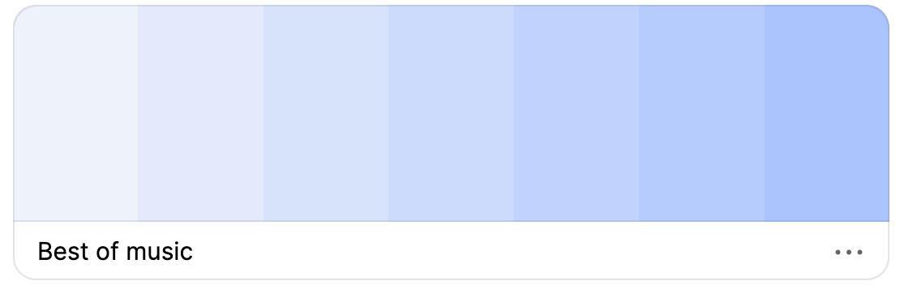
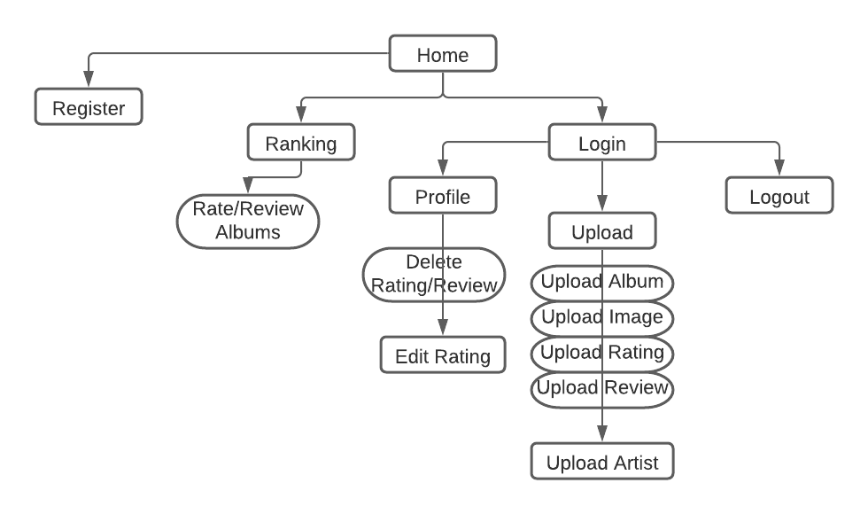

<h1 align="center">Best of Music</h1>


<h1>About:</h1>
This is the website for Best of Music. A community that will allow users to upload their favourite artist/albums and rate them accordingly. Users have the ability to see which albums are more recently uploaded and the highest rated albums. Users will also be able to rate the music that is uploaded and edit their own ratings or reviews as they see fit. Best of music is designed to be responsive on all screen sizes and work across multiple devices. Ensuring it is easy for new and existing users to sign up, login, and upload their favourite albums and rate existing ones. 

Link found here: [Best Of Music](http://best-of-music.herokuapp.com/)


## Contents
-  ###  [UX User Experience](#User-Experience-(UX))
    -   [User Stories](#User-stories)
    -   [Site Owner Goals](#Site-Owner-Goals)

-  ###  [Website Design](#Design-Choices) 
    -   [Typography](#Typography)
    -   [Colours](#Colour-Scheme)
    -   [Imagery](#Imagery)
    -   [Wireframes](#Wireframes)

-  ###  [Technologies](#Technologies-Used)
    -   [Languages](#Languages-Used)
    -   [Database](#Database-Used)
    -   [Libraries](#frameworks-Libraries-&-Programs-Used)

-  ###  [Features](#Features)  
    -   [Site Navigation](#Site-Navigation)
    -   [Current Features](#Current-Features)

-  ###  [Testing](TESTING.md)

-  ###  [Deployment](#GitHub-Pages)
    -   [GitHub Pages](#GitHub-Pages)

-  ###  [Credits](#Code)
    -   [Code](#Code)
    -   [Content](#Content)
    -   [Media](#Media)

    ## User Experience (UX)

### User stories

-   ### As a First Time User

    - I want to be able to quickly understand the websites purpose.
    - I want to easily navigate the site and see what content is available.
    - I would like the site to be responsive on all devices.
    - I want to be able to quickly join so I can rate music.
    - I would like the ability to read reviews of the music uploaded.
    - I want to be able to see ratings of all the music uploaded.


-   ### As a Returning User

    - I want to be able to easily login.
    - I want to still be able to see uploaded albums.
    - I would like the ability to upload music.
    - I would like the ability to read reviews of the music uploaded.
    - I would like to be able to edit my own ratings or reviews if I change my mind.


-   ### Frequent User

    - I want to be able to upload new artists.
    - I want to be able to see my uploaded music or reviews easily. 
    - I would like to rate different albums.
    - I would like the ability to read reviews of the music uploaded by different users.
    - I want to have the option to edit or delete my reviews.


-   ### Site Owner Goals

    -  Create a music community sharing the most liked or even disliked albums so that the user and even owner can show relive nostalgic music or find new music.


## Design Choices 

-   ### Colour Scheme



- Coolors was used to get the inspiration for the color theme.
- #b6ccfe; for the background
- #463f3a; for the font color


## Typography

-  ### Fonts

- Default Materalize font is used.


##  Imagery

- The main imagery will be supplied from what the user uploads with the album they choose to upload.

- [Fotor](https://fotor.com) Was used to create the main index page image and the navigation bar logo.


## Wireframes

-   ### [Home](/readme/homewf.png)
-   ### [Profile](/readme/profilewf.png)
-   ### [Login](/readme/loginwf.png)
-   ### [Upload](/readme/uploadwf.png)
-   ### [Upload Artist](/readme/uploadartistwf.png)
-   ### [Ranking](/readme/rankingswf.png)
-   ### [Register](/readme/registerwf.png)


###  Site Navigation

-  ### User site map

  

-   ### Current Features

    - All dynamics of CRUD functionality have been implemented in this site for registered users who are logged in.


    | Function      | Location       | 
    | ------------- | -------------  | 
    | Create        | Upload albums  |
    |               | Upload Artist  |
    |               | Write Review   |
    |               | Rate Albums    |
    | Read          | Read Reviews   | 
    |               | All Reviews    |
    | Update        | Edit Review    |
    |               | Update Rating  | 
    | Delete        | Reviews& Ratings| 


    ###  Header  [see here](/readme/navbar.png)

-   ### Navigation bar

    - Upon entering the website, users will be greeted with a clean and easy to read navigation bar indicating where to go(home/rankings/login/register)

    - If they go to the registration link it will allow the user to sign up for a new account and will direct them to their new profile.

    - Jinja if statements were used to ensure only certain navigation links are visible to registered users. Unregistered users will not have access to upload or rate.


### Mobile [see here](/readme/navbarmobile.png)

-   ### Navigation bar

    -  Here is the mobile navigation bar users will use when they are viewing from the mobile.


###  Log In  [see here](/readme/login.png)

-  ### User Log In 

    - The page that the users will use to login.

###  Register  [see here](/readme/register.png)
 
-  ### Register Page 

    -  Where new users will register to get a new account.

###  Profile  [see here](/readme/profile.png)  

-   ### User Profile  

    - Returning users will return to this page where they can see their uploaded posts.

###  Rankings  [see here](/readme/ranking.png)

-  ### Rankings page 

    - Where users logged in or not can see the highest rated albums

###  Ranking Modals  [see here](/readme/ratingmodal.png)

-  ###  Ranking Modal info

    - Where users can see the reviews and info of what albums are uploaded.

###  Ranking Modals Ratings  [see here](/readme/ratingmodalRated.png)

-  ###  Ranking Modal ratings

    - Where users can rate what albums are uploaded.

### Edit Rating  [see here](/readme/editrating.png)

-  ### Edit Reviews/Reviews

   - Users can click from their profile page to edit what they have reviewed or edited.

### Log In  [see here](/readme/logout.png)

- Where users will see when logged in.

-  ### Users Logged Out [see here](/readme/loggedout.png)

    - Where users will see when logged out.


### Footer  [see here](/readme/footer.png)

-  ### Links 

    - The footer contains links to social media.

    - Copyright information can be found here also.    


###  Features

- Some key features of this website will allow users :
    - Upload albums with their image, rating and review.
    - Upload new artists to rate that artists music.
    - Edit their own exisiting ratings or reviews.
    - Rate albums uploaded via rankings.
    - Delete ratings/reviews they have posted.


## Database Layout

-  ### Collections

    | Title         | Field          | Data Type |
    | ------------- | -------------  | --------- |
    | albums        | _id            | ObjectId  |
    |               | album_name     | string    |
    |               | artist_id      | string    |
    |               | image_url      | string    |
    |               | created_by     | string    |
    

    | Title         | Field          | Data Type |
    | ------------- | -------------  | --------- |
    | artists       | _id            | ObjectId  |
    |               | artist_name    | string    |


    | Title         | Field          | Data Type |
    | ------------- | -------------  | --------- |
    | ratings       | _id            | ObjectId  |
    |               | album_id       | ObjectId  |
    |               | rating         | string    |
    |               | review         | string    |
    |               | created_by     | string    |


    | Title         | Field          | Data Type |
    | ------------- | -------------  | --------- |
    | users         | _id            | ObjectId  |
    |               | username       | string    |
    |               | email_address  | string    |
    |               | password       | string    |
   
    
## Technologies Used

### Languages Used

-   ### [HTML5](https://en.wikipedia.org/wiki/HTML5)
    -   Used as the main markup language for the information.
-   ### [CSS3](https://en.wikipedia.org/wiki/CSS)
    -   Used to add styling to the website.
-   ### [Python3](https://en.wikipedia.org/wiki/Python)
    -   Used to make the site run and speak to the mongodb database.
-   ### [JavaScript](https://en.wikipedia.org/wiki/JavaScript)
    -   Used to validate the Materialize forms and functionalities 

### Database Used

-   ### [MongoDB Atlas](https://cloud.mongodb.com/)
    -   Used to store usernames, albums, ratings and artists

### Frameworks & Libraries

-  ### [JQuery](https://jquery.com/)
    -  Used for the initialisation of Materialize CSS components
-  ### [Materialize:](https://getbootstrap.com/docs/5.0/getting-started/download/) 
    -  Used to design a mobile responsive website along with custom components
-  ### [Flask](https://en.wikipedia.org/wiki/Flask)
    -  Used as a lightweight WSGI web application framework
-  ### [PyMongo](https://docs.mongodb.com/drivers/pymongo/)
    -  A Python distribution containing tools for working with Mongo
-  ### [Flask-PyMongo](https://flask-pymongo.readthedocs.io/en/latest/)
    -  Flask-PyMongo bridges Flask and PyMono
-  ### [Werkzeug](https://de.wikipedia.org/wiki/Werkzeug)
    -  A comprehensive WSGI web application library
-  ### [itsDangerous](https://itsdangerous.palletsprojects.com/en/2.0.x/)
    -  Allows data to be sent and received safely using python and secret keys
-  ### [DNSPython](https://pypi.org/project/dnspython/)
    -  A DNS toolkit for Python
-  ### [Jinja2](https://jinja.palletsprojects.com/en/3.0.x/)
    -  Jinja2 is a full-featured template engine for python    
-  ### [Click](https://click.palletsprojects.com/en/8.0.x/)
    -  A Python package for creating beautiful command line interfaces 


### Programs Used

-  ### [Heroku](https://id.heroku.com/)
    -  Used to deploy, manage, and scale modern apps
-  ### [Gitpod](https://www.gitpod.io/)
    -  An online IDE linked to the GitHub repository used to write my code.    
-  ### [Git](https://git-scm.com/)
    -  Git was used for version control by utilizing the Gitpod terminal to commit to Git and Puch to GitHub
-  ### [GitHub](https://github.com/)
    -  GitHub is used to store project codes after being pushed from the Gitpod    terminal
-  ### [JSHint](https://jshint.com/) 
    -  Used to detect errors in the JavaScript files 
-  ### [Font Awesome](https://fontawesome.com/) 
    -  Font Awesome were used on all social icons of the website.
-  ### [Fotor](https://www.fotor.com/)
    -  Fotor was used to create the background image for the index page and the logo
-  ### [Coolor](https://www.coolors.com/)
    -  Coolor was used to get inspiriation for the color theme
-  ### [Balsamiq](https://balsamiq.com/)
    - Balsamiq was used to create the wireframes during the design process

## Testing

-  ### All testing can be found [here](TESTING.md) 

## Deployment

### The project was developed using [Gitpod](https://www.gitpod.io/) and pushed to [GitHub](https://github.com/) then deployed on
Heroku using the following steps...    
 
1. Create requirements.txt file using command pip3 freeze --local > requirements.txt
2. Create a Procfile with the terminal command echo web: python app.py > Procfile and at this point checking the Procfile to make sure there is no stray line as this can cause issues when deploying to Heroku.
3. The new requirements file and Procfile committed to GitHub.
4. New app created in Heroku by clicking "New" and "Create New App" and giving it an original name and setting the region to closest to location.
5. From Heroku dashboard click "Deploy" -> "Deployment Method" and select "GitHub"
6. Search for GitHub repo and connect.
7. In the dashboard click "Settings" -> "Reveal Config Vars"
8. Set config vars:

- ## Table

    | Key           | Location        | 
    | ------------- | -------------   | 
    | PORT          | 5000            | 
    | IP            | 0.0.0.0         |
    | SECRET_KEY    | USER_SECRET_KEY |
    | MONGO_URI     | USER_MONGO_URI  | 
    | MONGO_DBNAME  | book_hub        |
 
  
## GitHub Pages

1. Log in to GitHub and locate the [GitHub Repository](https://github.com/)
2. At the top of the Repository (not top of page), locate the "Settings" Button on the menu.
   Alternatively Click [Here](https://raw.githubusercontent.com/) for a GIF demonstrating the process starting from Step 2.
3. Scroll down the Settings page until you locate the "GitHub Pages" Section.
4. Under "Source", click the dropdown called "None" and select "Master Branch".
5. The page will automatically refresh.
6. Scroll back down through the page to locate the now published site [link](https://github.com) in the "GitHub Pages" section.

### Forking the GitHub Repository

By forking the GitHub Repository we make a copy of the original repository on our GitHub account to view and/or make changes without affecting the original repository by using the following steps...

1. Log in to GitHub and locate the [GitHub Repository](https://github.com/)
2. At the top of the Repository (not top of page) just above the "Settings" Button on the menu, locate the "Fork" Button.
3. You should now have a copy of the original repository in your GitHub account.

### Making a Local Clone

1. Log in to GitHub and locate the [GitHub Repository](https://github.com/)
2. Under the repository name, click "Clone or download".
3. To clone the repository using HTTPS, under "Clone with HTTPS", copy the link.
4. Open Git Bash
 5. Change the current working directory to the location where you want the cloned directory to be made.
 6. Type `git clone`, and then paste the URL you copied in Step 3.

```
    $ git clone https://github.com/YOUR-USERNAME/YOUR-REPOSITORY
```

        7. Press Enter. Your local clone will be created.

```
    $ git clone https://github.com/YOUR-USERNAME/YOUR-REPOSITORY
    > Cloning into `CI-Clone`...
    > remote: Counting objects: 10, done.
    > remote: Compressing objects: 100% (8/8), done.
    > remove: Total 10 (delta 1), reused 10 (delta 1)
    > Unpacking objects: 100% (10/10), done.
```
---

## Credits

-   ### Code

    - The Code Institute material was the main source of information used to create this project.

    - Materialize CSS Library used throughout the project mainly to make site responsive using the Grid System [https://materializecss.com/](https://materializecss.com/)

-   ### Content

    -  All coding content was written by the developer.

    - w3schools was used as a supplementary source for tips.

    - [Dev.io](https://dev.to/kpulkit29/custom-validation-in-materialize-css-1p0e) Was used to validate the Image URL

    - [Matt Rudge Pagination](https://github.com/lechien73/paginate_test) Pagination_test was used to help paginate the rankings with mentor Matt Rudge's help

    - Materialize for creating a responsive website.

-   ### Media

    -  Logo Image and Home Page Background was created by the developer using Fotor to crop and edit photo and using their custom etxt [Fotor](https://www.fotor.com/)

  
-   ### Acknowledgements

    - Code Institute for their support and providing all of the necessary knowledge and material.